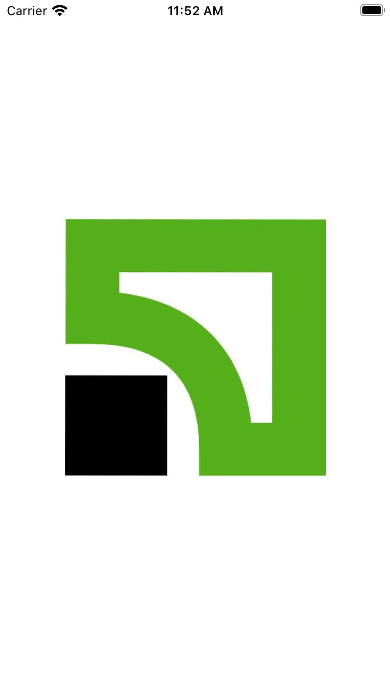
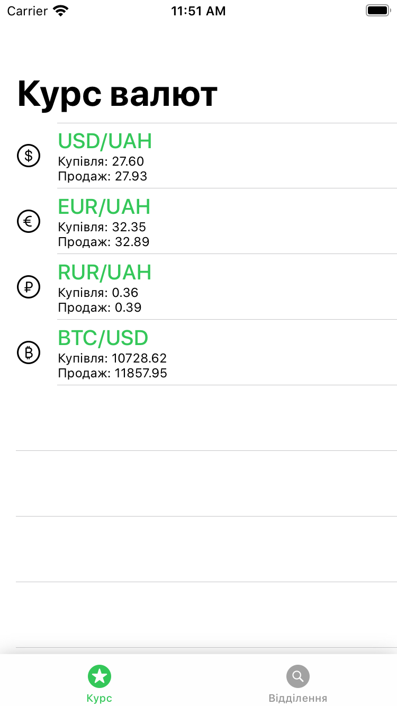
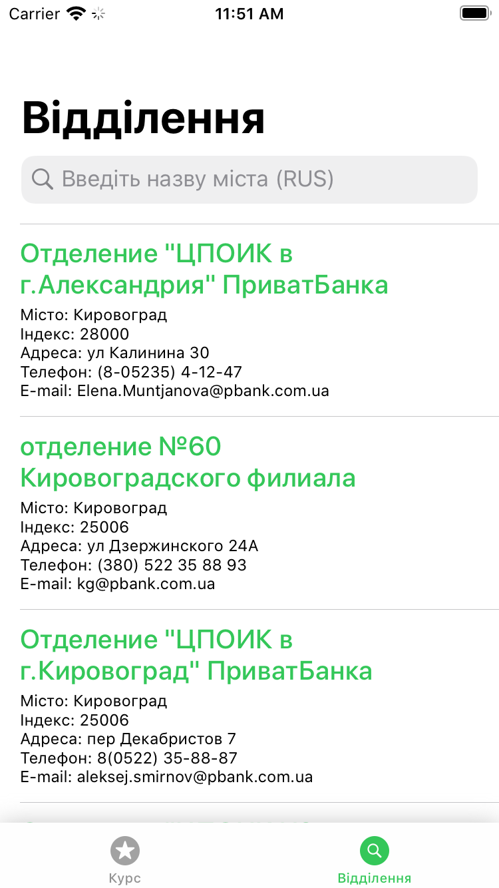
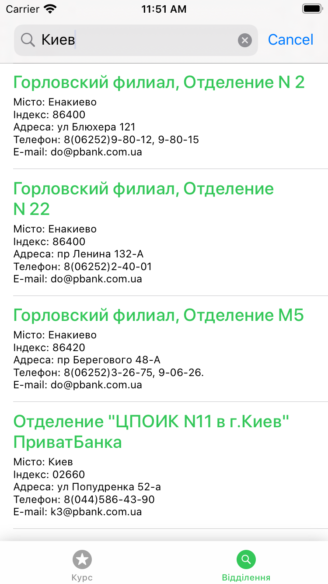

# Exchange rate

A mobile application to keep track of the current exchange rate, as well as view a list of offices located in a particular city. Data is provided by Privat Bank using an open API

    
    
    
    

## Getting Started

    

Authentication is handled with a simple API.
They're free for development, open-source, and non-commercial use, and you can get one here: [get Privat24 API](https://api.privatbank.ua/#p24/exchange).

# Installation
1. Install Cocoapods: sudo gem install cocoapods
2. Update pods in folder: pod update
3. Install [Moya/RxSwift](https://github.com/Moya/Moya#cocoapods)
4. Install [RxSwift & RxCocoa](https://github.com/ReactiveX/RxSwift#installation)
5. Install [RxSwiftUtilities](https://github.com/RxSwiftCommunity/RxSwiftUtilities#installation)
6. Build project from Xcode.
